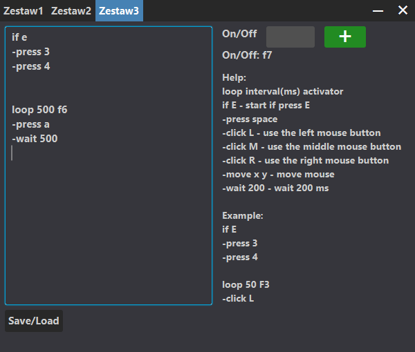

# Clicker3

Clicker3 is a configurable auto-clicker and macro automation tool built with JavaFX. It allows you to create custom scripts using simple commands – such as left/right/middle clicks, mouse movements, key presses, and delays – organized within loops and conditional (if) blocks. The tool runs in the background, listens for a global hotkey (default F2) to toggle activation, and can switch between three independent script sets. All settings and scripts are automatically saved to disk and reloaded on startup.

## Requirements

* Java 8 or later (JavaFX must be available)